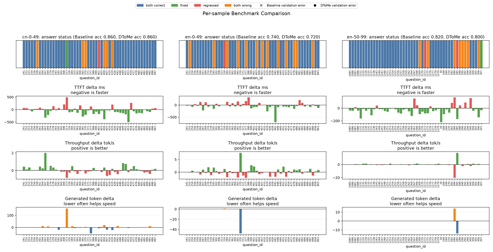
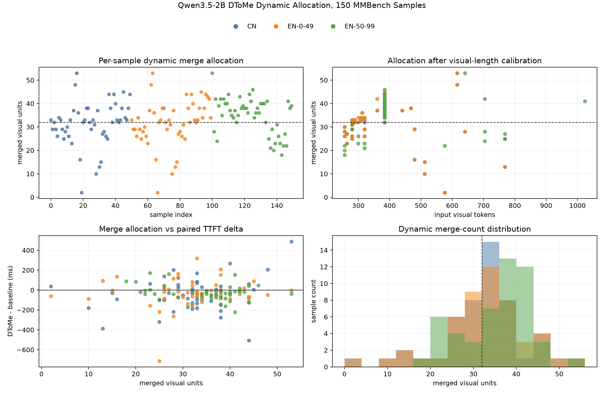

# Qwen3.5-2B DToMe 适配与完整评估

日期：2026-07-29

## 1. 目的与范围

固定 ToMe 对所有图片合并相同数量的视觉单元，无法区分高冗余图片和复杂图片。本实验
适配 DyMU 中 DToMe 的动态阈值思想：根据视觉单元匹配分数决定每张图片的实际合并量，
并在 150 条 MMBench 公开样本上验证准确率与性能。

- 论文：[DyMU: Dynamic Merging and Unmerging for Token Compression](https://arxiv.org/abs/2504.17040)
- 官方实现：[MikeWangWZHL/dymu](https://github.com/MikeWangWZHL/dymu)

本实验只实现 DToMe 阈值匹配核心，不包含论文的完整 VTU、逐层配置或训练流程，因此
不能称为完整 DyMU 复现。

## 2. 实现与 Qwen 适配

DToMe 保留项目现有的 Qwen 2x2 visual unit、加权聚合、空间顺序、proportional
attention 和末层恢复逻辑，只改变匹配数量：

1. 计算 ToMe 偶数源 unit 到奇数目标 unit 的最佳余弦相似度；
2. 不再固定选取 top-r，而是合并所有高于校准阈值的源边；
3. 匹配分数使用 FP32 计算，避免 BF16 大量同分导致阈值跳变；
4. 零合并时直接回到原模型后续路径，不执行空聚合或 proportional attention；
5. 实际合并量、阈值和视觉 token 数写入每个样本的运行元数据。

官方 DToMe 面向视觉 token 数基本固定的 ViT。Qwen3.5 使用动态分辨率，候选目标越多，
最佳相似度的统计值会自然升高。原论文的单一阈值直接迁移后，COCO 校准目标为 32，
但前 20 条 MMBench 只合并 `9.7` 个 unit。因此本实验增加了按候选源边数量选择阈值的
工程适配。该分桶策略是本项目为 Qwen 动态分辨率提出的扩展，不是论文原始模块。

所有新增能力均需显式选择 `matching="dtome"` 并提供阈值或校准文件。默认匹配仍为
普通 `tome`，不会改变现有运行行为。

## 3. 独立校准

校准没有读取竞赛问题、选项、答案或标签，使用 512 张 COCO 2017 validation 图片。
随机种子为 `20260728`，图片清单哈希为：

```text
359f4f49ca8743f50961f36d063be0c5c00bae83324a8f478a117cc8624cf648
```

为覆盖当前 MMBench 中约 256–768 个视觉 token 的输入范围，COCO 图片均匀轮换
`98304 / 131072 / 163840 / 196608` 四档最大像素预算。

| 候选源边上限 | 校准图片 | 阈值 | 平均合并 | 合并范围 |
|---:|---:|---:|---:|---:|
| 48 | 129 | 0.845276 | 32 | 15–43 |
| 64 | 128 | 0.884584 | 32 | 15–50 |
| 80 | 136 | 0.892955 | 32 | 10–61 |
| 96 | 119 | 0.907835 | 32 | 6–63 |

阈值随候选规模单调升高，验证了单阈值失败来自动态分辨率的统计偏置。四个桶均有
119 条以上图片，不再依赖少量低分辨率样本。

## 4. 验证与评测设置

代码测试结果：

```text
105 passed, 1 skipped
```

- 设备：Apple Silicon MPS；
- 模型：Qwen3.5-2B；
- 协议：DNDX v1.1，最多生成 256 token；
- 配置：视觉第 16 层，目标 `r=32`，proportional attention；
- 数据：EN 0–49、EN 50–99、CN 0–49，共 150 条；
- 方法：同一模型、同一样本交替运行 baseline 和 DToMe；
- 校准：仅使用上述 COCO 多分辨率校准文件。





## 5. 150 条完整结果

| 数据 | Baseline | DToMe | 准确率变化 | TTFT 平均变化 | TTFT 中位变化 | 平均合并 |
|---|---:|---:|---:|---:|---:|---:|
| EN 0–49 | 74% | 72% | -2 pp | -28.9 ms | -36.4 ms | 31.92 |
| EN 50–99 | 82% | 80% | -2 pp | -28.0 ms | -27.8 ms | 34.88 |
| CN 0–49 | 86% | 86% | 0 pp | -44.7 ms | -47.8 ms | 31.54 |
| 合计 | 80.67% | 79.33% | -1.34 pp | -33.8 ms | -34.5 ms | 32.78 |

150 条输出全部通过官方公开校验。实际合并范围为 `2–53`，证明动态预算确实生效，
而不是换一种方式固定合并 32 个 unit。

答案状态变化：

- EN 0–49：新增错误 1 题；
- EN 50–99：修正 1 题，新增错误 2 题；
- CN 0–49：修正 1 题，新增错误 1 题；
- 合计：Baseline 121 题正确，DToMe 119 题正确，净损失 2 题。

吞吐率平均变化为 `+0.083 token/s`，幅度很小，不能视为显著 decode 提升。

## 6. 与固定策略比较

| 方法 | Baseline 正确 | Candidate 正确 | 净变化 | TTFT 平均变化 | TTFT 中位变化 |
|---|---:|---:|---:|---:|---:|
| 固定 ToMe | 121 | 122 | +1 | -19.8 ms | -17.5 ms |
| PiToMe | 121 | 120 | -1 | -27.0 ms | -24.8 ms |
| 分桶 DToMe | 121 | 119 | -2 | -33.8 ms | -34.5 ms |

三种方法来自各自的 paired 运行，因此表中只比较相对同轮 baseline 的变化。DToMe
获得最大的端到端 TTFT 降幅，但准确率最差，没有优于固定 ToMe 的准确率–性能
Pareto 优势。

## 7. 同步视觉编码器剖析

为区分真实计算变化与 MPS 调度波动，额外对前 20 条英文图片执行同步视觉块计时。

| 方法 | 压缩后平均 token | 合并层 L16 增量 | L18–L23 单层节省 | 视觉编码器总变化 |
|---|---:|---:|---:|---:|
| 固定 ToMe | 256.2 | +19.2 ms | 约 2.9–3.1 ms | +6.5 ms |
| 分桶 DToMe | 261.6 | +30.6 ms | 约 2.7–3.7 ms | +8.4 ms |

DToMe 的 FP32 相似度和动态选择使合并层比固定 ToMe 更贵。后续层确实因序列缩短而
加速，但在当前单层 L16 配置中不足以覆盖合并开销。因此端到端 TTFT 的负向变化不能
解释为稳定的视觉算力收益，更可能混有 MPS 调度、编译和动态形状缓存波动。

## 8. 结论

本阶段回答了此前的关键问题：

- **DToMe 核心能否适配 Qwen3.5？** 能，动态合并、恢复与输出验证均正常。
- **论文单阈值能否直接迁移？** 不能。Qwen 动态分辨率会导致明显长度偏置。
- **分桶校准是否修正压缩预算？** 是。150 条平均合并 `32.78`，范围 `2–53`。
- **是否比固定 ToMe 更保精度？** 否。DToMe 净损失 2 题，固定 ToMe 净修正 1 题。
- **是否得到可信的视觉计算加速？** 否。同步视觉编码器计时仍慢 `8.4 ms`。

因此 DToMe 和分桶阈值应保留为实验能力，但当前不应替代固定 ToMe。继续依据
MMBench 调阈值会接近赛事禁止的数据集特定优化，也缺乏泛化依据。若后续在 CUDA/PPU
上重测，可重新评估 FP32 匹配代价；在当前 MPS 与单层 L16 路线下，本阶段可以结束。

实验限制：校准集为 512 张 COCO，而官方建议更大、更丰富的数据；本实验未实现
完整 DyMU 的 VTU；所有性能结论仅代表当前 Apple Silicon MPS 软件栈。
