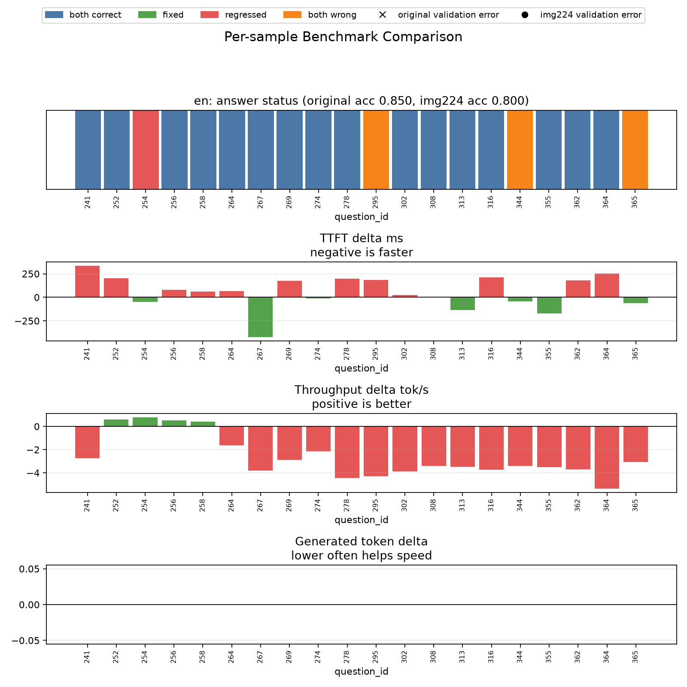
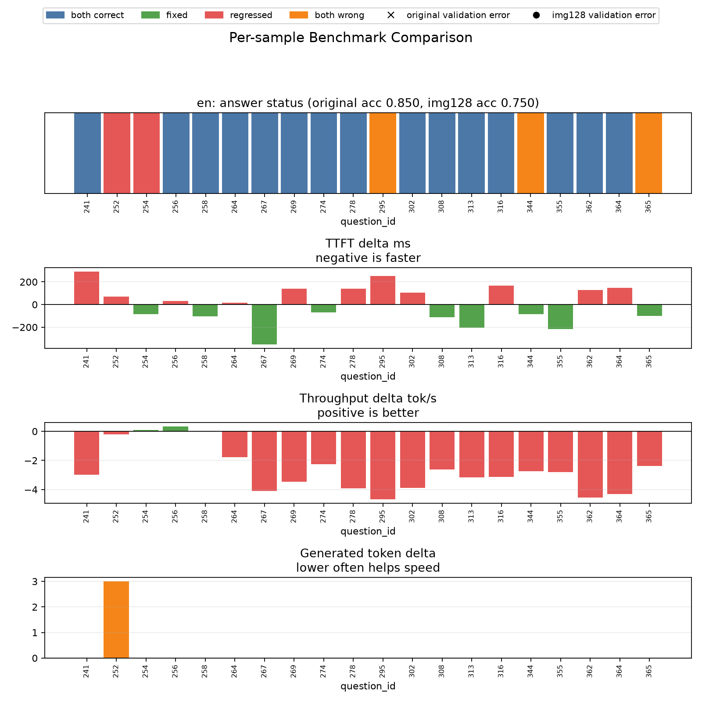

# 图像输入缩放与 Visual Token 初步实验

## 背景

本实验属于 A 方向：图像 Token 剪枝 / 视觉输入压缩。目标不是实现 FastV 本体，而是先建立一条可复现的实验链路：

- 控制输入图片尺寸；
- 记录 processor 实际生成的 visual token 数；
- 对比准确率、TTFT、吞吐量变化；
- 判断“粗粒度 resize”是否值得作为后续优化方向。

本轮实验已将 prompt 恢复为原始 benchmark prompt，避免混入 prompt 缩短带来的影响。

## 实验设置

数据集：`mmbench_dev_en.tsv` 前 20 条样本  
模型：`Qwen3.5-2B`  
设备：Mac MPS  
后端：`transformers`  
warmup：2 samples  
生成配置：`max_new_tokens=64, temperature=0.0, top_p=1.0`

对比组：

| 组别 | 图像处理 |
| --- | --- |
| `original` | 不限制图片尺寸 |
| `image_max_edge=224` | 将最长边限制到 224 |
| `image_max_edge=128` | 将最长边限制到 128 |

## 核心结果

| 组别 | 平均 image tokens | Accuracy | Avg TTFT ms | Throughput tok/s |
| --- | ---: | ---: | ---: | ---: |
| `original` | 96.05 | 0.85 | 1182.353 | 19.989 |
| `image_max_edge=224` | 73.05 | 0.80 | 1236.160 | 17.336 |
| `image_max_edge=128` | 70.55 | 0.75 | 1189.926 | 17.365 |

## 对比图

### Original vs image_max_edge=224

### Original vs image_max_edge=128

## 发现

1. `--image-max-edge` 已经能够有效控制 visual token 数。

   原始输入平均 image token 数为 `96.05`，限制最长边后下降到 `73.05` 和 `70.55`。这说明当前实验链路可以用于后续构建“图像尺寸 / visual token 数 / 性能”的对比。

2. 粗暴 resize 没有带来性能收益。

   `image_max_edge=224` 和 `image_max_edge=128` 都降低了 visual token 数，但 TTFT 没有下降，吞吐量反而下降。这说明当前瓶颈不一定能通过简单缩图解决，或者缩图引入的 processor / 模型行为变化抵消了 token 数下降收益。

3. 缩图带来了明确的准确率风险。

   `image_max_edge=224` 准确率从 `0.85` 降到 `0.80`，`image_max_edge=128` 降到 `0.75`。其中 `224` 新错 1 题，`128` 新错 2 题。对 VLM 任务而言，OCR、小物体、空间关系和细节识别都可能受输入分辨率影响。

4. 下一步更应该转向 FastV 式中间层 token pruning。

   resize 是输入级粗压缩，会在模型看到图片前损失视觉细节。FastV 的思路是先保留完整图像信息经过若干层，再剪掉后续层中低价值 visual tokens。相比 resize，它更符合“保精度、降后续计算”的目标。

## 暂定结论

本轮实验不支持将简单 resize 作为主优化策略。它的主要价值是帮助我们验证了 visual token 统计链路，并证明粗粒度图像压缩存在明显准确率风险。

后续 A 方向应继续推进：

- 统计更多样本上的 image token 分布；
- 尝试较温和的尺寸上限，例如 `384`、`448`、`512`；
- 分析错误样本是否与 OCR / 小目标 / 细粒度视觉相关；
- 开始设计 FastV-lite：先在不改中间层 attention ranking 的情况下验证“剪 visual token 后模型是否能稳定运行”。
