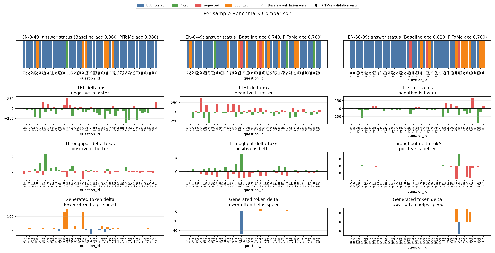

# Qwen3.5-2B PiToMe 适配与评估

日期：2026-07-28

## 1. 目的

现有 ToMe 已经证明视觉编码器内部缩短序列能够降低真实计算时间，但固定二分匹配仍会
改变部分答案。本实验将 PiToMe 的 energy-based matching 核心适配到项目现有的
Qwen3.5 单层 unit-level ToMe 框架，验证它能否在相同压缩率下更好地保护独特、
信息量高的视觉 token。本实验不是 PiToMe 论文完整逐层配置的严格复现。

- 论文：[Accelerating Transformers with Spectrum-Preserving Token Merging](https://arxiv.org/abs/2405.16148)
- 官方实现：[hchautran/PiToMe](https://github.com/hchautran/PiToMe)

## 2. 实现

PiToMe 复用项目现有的加权聚合、token size、proportional attention 和末层恢复逻辑，
仅替换匹配策略：

1. 对视觉 unit 的 Key metric 进行归一化并计算完整 cosine 相似度矩阵；
2. 使用官方视觉实现的 `mean(ELU(similarity - 0.5))` 计算 energy；
3. 只让 energy 最高的 `2r` 个冗余 unit 参与二分匹配；
4. 其余低 energy、相对孤立的 unit 不参与合并；
5. 源 unit 仍按已有 token size 进行加权聚合。

新策略通过显式 `matching="pitome"` 或命令行 `--matching pitome` 启用。默认值仍是
`tome`，因此未显式启用时不会改变现有模型行为。

与论文完整设置相比，本实验的适配差异包括：

- 合并 Qwen3.5 `PatchMerger` 对应的 2x2 unit，而不是普通 ViT patch token；
- 只在视觉第 16 层执行一次合并，而不是论文中的逐层渐进压缩；
- `r=32` 是为了与现有 ToMe 实验公平比较，不是论文指定配置；
- proportional attention、空间顺序保持和末层长度恢复来自现有 Qwen3.5 ToMe 适配。

## 3. 验证

代码测试结果：

```text
95 passed, 1 skipped
```

真实 Qwen3.5-2B 冒烟确认：

- 视觉 token：`320 -> 192 -> 320`；
- 合并 unit：32；
- 模型完成生成；
- 公开输出校验通过；
- 完整压缩和恢复链路可正常执行。

同步算子剖析经过 5 次预热和 20 次重复。在本实验最常见的 320 token 输入上：

| 方法 | Metric preparation | Matching | 完整合并核心 |
|---|---:|---:|---:|
| 普通 ToMe | 0.364 ms | 0.635 ms | 3.460 ms |
| PiToMe | 0.299 ms | 0.414 ms | 2.591 ms |

这里的“完整合并核心”包含 metric preparation、matching、加权聚合、输出压紧和结果组装。
PiToMe 没有增加算子固定开销，当前结果不佳不能归因于 energy 计算过慢。

## 4. 评测设置

- 设备：Apple Silicon MPS；
- 模型：Qwen3.5-2B；
- 评测协议：DNDX v1.1，最多生成 256 token；
- 配置：视觉第 16 层，`r=32`，proportional attention；
- 数据：EN 0-49、EN 50-99、CN 0-49，共 150 条；
- 方法：同一模型、同一样本交替运行 baseline 和 PiToMe；
- 对照：此前同配置普通 ToMe paired benchmark。



## 5. PiToMe 结果

| 数据 | Baseline Accuracy | PiToMe Accuracy | 准确率变化 | TTFT 平均变化 | TTFT 中位变化 | 更快样本 |
|---|---:|---:|---:|---:|---:|---:|
| EN 0-49 | 74% | 76% | +2 pp | +3.1 ms | -13.5 ms | 27/50 |
| EN 50-99 | 82% | 76% | -6 pp | -32.7 ms | -25.8 ms | 34/50 |
| CN 0-49 | 86% | 88% | +2 pp | -51.4 ms | -44.3 ms | 35/50 |
| 合计 | 80.67% | 80.00% | -0.67 pp | -27.0 ms | - | 96/150 |

所有 150 条输出均通过公开校验。PiToMe 共改变 9 个样本的答案状态：

- EN 0-49：修正 3 题，新增 2 题错误；
- EN 50-99：新增 3 题错误；
- CN 0-49：修正 1 题，没有新增错误。

## 6. 与普通 ToMe 比较

| 方法 | 150 题 Baseline 正确 | Candidate 正确 | 净变化 | TTFT 平均变化 |
|---|---:|---:|---:|---:|
| 普通 ToMe | 121 | 122 | +1 | -19.8 ms |
| PiToMe | 121 | 120 | -1 | -27.0 ms |

两种方法来自各自的 paired 运行，因此 TTFT 只比较各自相对同轮 baseline 的差值，不能
直接比较候选绝对耗时。两轮 baseline 的 150 个解析答案完全一致，准确率对照具有可比性。

PiToMe 在中文首组上同时提高准确率和降低 TTFT，但没有在第二组英文复现。总体上，
它比普通 ToMe 多获得约 7 ms 的平均 TTFT 降幅，却从净修正 1 题变为净损失 1 题，
没有形成更好的准确率–性能 Pareto 优势。

## 7. 结论

本实验已经回答上一阶段的问题：

- **PiToMe 能否适配当前 Qwen3.5 视觉编码器？** 能，且无需新增依赖。
- **energy-based matching 是否明显增加固定开销？** 没有，匹配耗时中位数与 ToMe 接近。
- **是否比普通 ToMe 更好地保持准确率？** 当前 150 条结果不支持这一结论。
- **是否值得继续围绕 PiToMe 调 energy 公式？** 暂不值得。针对当前测试集调 margin 或
  energy 形式既缺乏泛化证据，也容易接近赛事禁止的数据集特定优化。

下一步应保留 PiToMe 为可选实验策略，但停止继续调参。更值得验证的是 DyMU 式动态
预算：根据每张图片自身的冗余程度决定合并数量，避免固定 `r=32` 对低 token、复杂图片
过度压缩。
