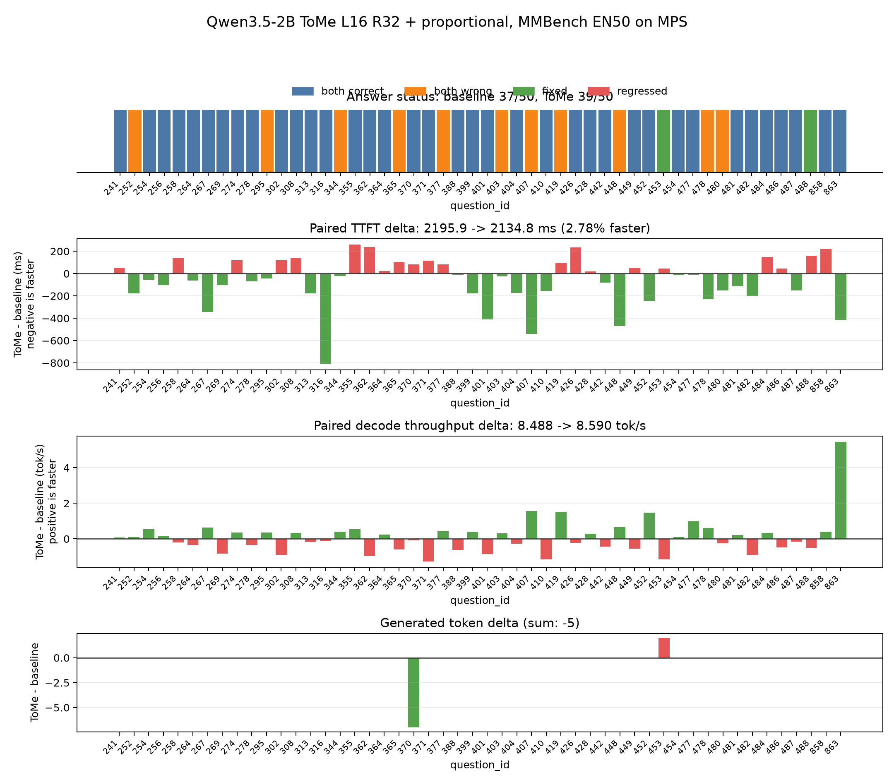
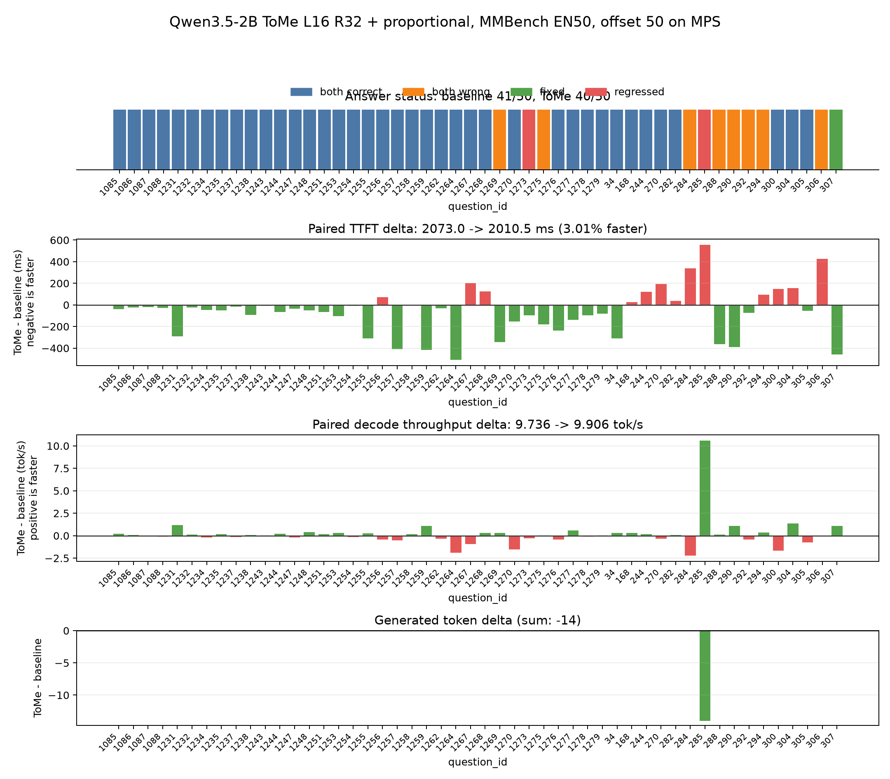
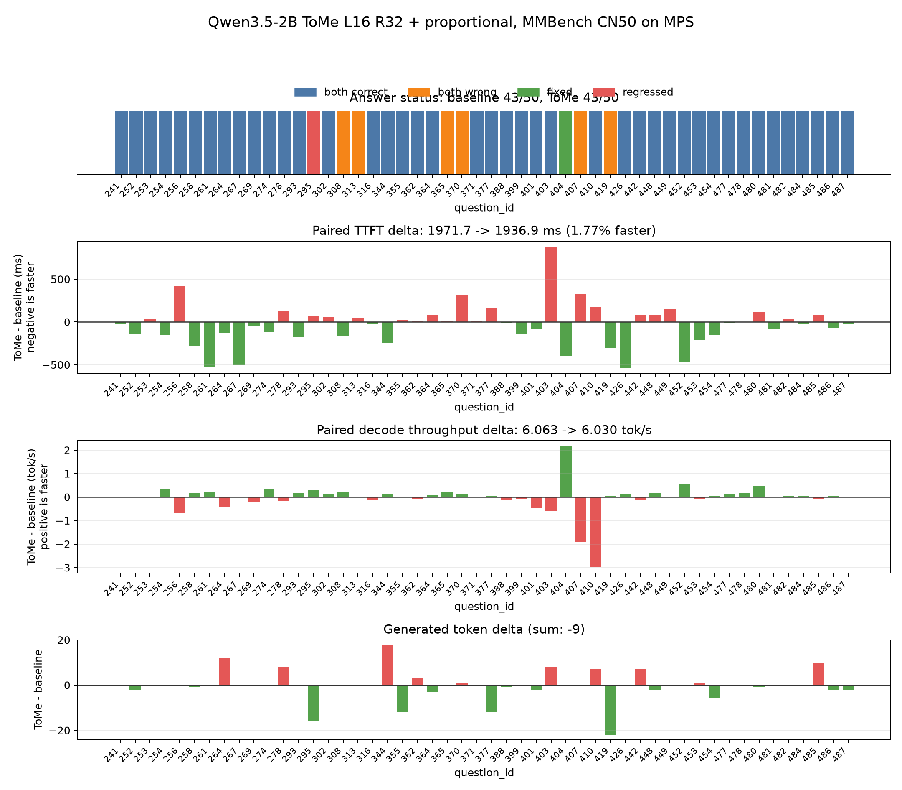

# Qwen3.5-2B ToMe 完整评估报告

日期：2026-07-13

## 摘要

本方向将 ToMe（Token Merging）适配到 Qwen3.5-2B 的视觉编码器，并在 Apple Silicon MPS 上完成算子、视觉层、端到端性能与中英文准确率评估。

最终候选为：

```text
视觉第 16 层执行 unit-level ToMe
r = 32 个 2x2 merge unit
启用 proportional attention
视觉末层恢复原长度后进入原生 PatchMerger
```

在两组不重叠 EN50 与一组 CN50，共 150 个样本上：

| 指标 | Paired Baseline | 最终候选 | 变化 |
|---|---:|---:|---:|
| 合计正确数 | 121/150 | 122/150 | +1 |
| 答案变化 | - | 7/150 | 4.67% |
| 回归 / 修复 | - | 3 / 4 | 净 +1 |
| 加权平均 TTFT | 约 2080.22 ms | 约 2027.41 ms | **-52.81 ms / -2.54%** |
| 推理 elapsed 合计 | 约 788.92 s | 约 773.34 s | **-15.58 s / -1.98%** |
| 总生成 Token 变化 | - | -28 | elapsed 受输出长度影响 |

结论：最终候选在三组数据上均获得正向 TTFT，合计准确率没有下降；但约 4.67% 的题目答案发生变化，因此它是一个有风险的速度优化候选，不是严格逐题无损方案。

## 研究背景

此前 FastV 风格语言模型中间层视觉 Token 剪枝没有形成正向权衡。视觉路径剖析表明：

- 完整视觉路径平均增加约 843 ms；
- 视觉编码器约占图文 forward 的 40%；
- 视觉增量中约 64% 发生在视觉编码器；
- 进入语言模型后平均只剩约 95 个视觉 Token。

因此，本方向转向视觉编码器内部 ToMe，而不是继续在语言模型中删除少量视觉 Token。

论文与实现计划见：

- `reports/A/tome_reproduction_plan.md`
- `reports/A/tome_single_layer_findings.md`
- [Token Merging: Your ViT But Faster](https://openreview.net/forum?id=JroZRaRw7Eu)

## 方法适配

### Qwen3.5 结构约束

Qwen3.5-2B 视觉编码器包含 24 个视觉 Block，并具有三个与标准 ViT 不同的约束：

1. 末端 `PatchMerger` 每次消费连续 2x2 Patch；
2. 每层 Attention 使用二维 RoPE；
3. 多图输入使用 packed sequence 与 `cu_seqlens`。

本项目以 2x2 merge unit 为最小单位。匹配与合并都保持四个相对 Patch 位置，避免破坏末端 `PatchMerger` 结构。

### ToMe 核心

实现包括：

- Attention Key metric；
- bipartite soft matching；
- size-weighted merge；
- packed 样本边界隔离；
- RoPE 与 `cu_seqlens` 同步裁剪；
- 末层按映射恢复原始视觉长度。

语言模型接收的视觉 Token 数保持不变，因此本方案主要优化视觉 prefill，不直接减少语言模型 decode cache。

### Proportional Attention

合并后的 Token 代表多个原始区域。后续视觉 Attention 在 key logits 中加入：

```text
log(token_size)
```

这使合并 Token 的注意力质量与其代表的区域数量成比例。实现复用原始 QKV、二维 RoPE 和输出投影，并通过显式 SDPA 路径执行。

## 性能机制验证

### ToMe 核心算子

在 BF16、hidden size 1024、MPS 上同步测量：

| 输入 Token | 紧凑 Token | Matching | Aggregation | 完整 ToMe 核心 |
|---:|---:|---:|---:|---:|
| 256 | 128 | 0.451 ms | 0.395 ms | 2.478 ms |
| 320 | 192 | 0.619 ms | 0.645 ms | 3.221 ms |
| 480 | 352 | 0.609 ms | 0.650 ms | 3.345 ms |
| 768 | 640 | 0.494 ms | 0.727 ms | 3.184 ms |

Matching 与 aggregation 不是数十毫秒级瓶颈。此前较大的 host 时间主要混入了 MPS 命令队列等待。

### 视觉层收益

EN5、320 Patch Token、L12R32 同步剖析：

| 区域 | Baseline | ToMe | 变化 |
|---|---:|---:|---:|
| 合并前视觉层 | 92.52 ms | 90.70 ms | -1.82 ms |
| 合并层 | 7.94 ms | 10.86 ms | +2.92 ms |
| 合并后视觉层 | 83.27 ms | 59.31 ms | -23.96 ms |
| 24 个视觉 Block | 183.73 ms | 160.86 ms | -22.86 ms |

完整视觉模型同步复测：

| 区域 | Baseline | ToMe | 变化 |
|---|---:|---:|---:|
| 24 个视觉 Block | 148.91 ms | 133.46 ms | -15.45 ms |
| 非 Block 视觉部分 | 89.88 ms | 90.90 ms | +1.03 ms |
| 完整视觉模型 | 238.79 ms | 224.36 ms | **-14.42 ms / -6.04%** |

这证明 ToMe 确实击中了视觉编码器瓶颈，而不是只降低理论 FLOPs。

## 评测协议

- 模型：本地 Qwen3.5-2B，BF16；
- 设备：Apple Silicon MPS；
- 数据：MMBench dev EN/CN；
- 生成上限：64 Token；
- 每轮预热：2 个样本；
- 比较方式：同一模型安装 ToMe 后，通过显式开关交替运行 baseline 与 candidate；
- 顺序控制：奇数题 candidate 先运行，偶数题 baseline 先运行；
- 比较指标：准确率、逐题答案、TTFT、decode 吞吐、elapsed、生成 Token 数。

paired baseline 同样经过空 ToMe wrapper，适合估计 ToMe 净增量；它不替代赛事官方绝对 baseline。

## 参数筛选

### 无 Proportional Attention

| 配置 | 数据 | 准确率变化 | 答案变化 | TTFT 结论 |
|---|---|---:|---:|---|
| L12R32 | EN50 | 37→36 | 3 | 约快 0.22% |
| L12R16 | EN20 | 16→16 | 2 | 约快 1.07% |
| L12R8 | EN20 | 16→17 | 1 | 均值慢约 0.52% |

单纯调整 `r` 没有找到逐题稳定且均值提速的配置。

### Proportional Attention EN20 筛选

| 配置 | 正确率变化 | 答案变化 | TTFT 变化 | 决策 |
|---|---:|---:|---:|---|
| L12R32 | 16→16 | 0 | -1.98% | 扩展验证 |
| L16R32 | 16→16 | 0 | -3.16% | 扩展验证 |
| L12R16 | 16→17 | 1 | -5.80% | 输出不稳定，不优先扩展 |

后移合并层比单纯减小 `r` 更有利于保持输出稳定。

## L12R32 Proportional 结果

### 前 50 题

- 正确率：37→38；
- 答案变化：3 题，1 回归、2 修复；
- TTFT：快 3.24%；
- 同批重复：准确率、变化题目、Token 差完全复现；TTFT 快 4.91%。


### 第 51-100 题

- 正确率：41→39；
- 答案变化：4 题，3 回归、1 修复；
- TTFT：快 4.95%。


两组 EN100 合计：78→77，净下降 1 题；答案变化 7%；TTFT 加权约快 4.16%。该配置速度更高，但准确率风险较大。

## 最终候选：L16R32 Proportional

### EN50 前 50 题

| 指标 | Baseline | Candidate | 变化 |
|---|---:|---:|---:|
| 正确率 | 37/50 | 39/50 | +2 |
| 答案变化 | - | 2 | 均为修复 |
| 平均 TTFT | 2195.93 ms | 2134.83 ms | **-2.78%** |
| Decode 吞吐 | 8.488 | 8.590 tok/s | +1.20% |
| Elapsed 合计 | 175.49 s | 169.88 s | -3.20% |
| Token 差 | - | -5 | Candidate 较短 |



### EN50 第 51-100 题

| 指标 | Baseline | Candidate | 变化 |
|---|---:|---:|---:|
| 正确率 | 41/50 | 40/50 | -1 |
| 答案变化 | - | 3 | 2 回归、1 修复 |
| 平均 TTFT | 2072.99 ms | 2010.51 ms | **-3.01%** |
| Decode 吞吐 | 9.736 | 9.906 tok/s | +1.75% |
| Elapsed 合计 | 151.38 s | 145.70 s | -3.75% |
| Token 差 | - | -14 | Candidate 较短 |



EN100 合计：

- 正确率：78→79；
- 答案变化：5/100，2 回归、3 修复；
- TTFT 两组分别快 2.78% 与 3.01%，加权约快 2.90%。

### CN50

| 指标 | Baseline | Candidate | 变化 |
|---|---:|---:|---:|
| 正确率 | 43/50 | 43/50 | 0 |
| 答案变化 | - | 2 | 1 回归、1 修复 |
| 平均 TTFT | 1971.72 ms | 1936.88 ms | **-1.77%** |
| Decode 吞吐 | 6.063 | 6.030 tok/s | -0.54% |
| Elapsed 合计 | 462.06 s | 457.76 s | -0.93% |
| Token 差 | - | -9 | Candidate 较短 |



中文上 TTFT 收益仍为正向，准确率没有净下降。

## 汇总结论

### 已证明

1. ToMe 核心算子在 MPS 上约为 2.5-3.4 ms，并非主要瓶颈。
2. 视觉序列缩短能真实加速后续视觉层。
3. 完整视觉模型在同步剖析中约快 6%。
4. Proportional attention 的 TTFT 收益在两组 EN50 和一组 CN50 上均为正向。
5. L16R32 比 L12R32 更稳健：EN100 答案变化率从 7% 降至 5%，准确率从净 -1 提升为净 +1。
6. 最终候选在 EN100+CN50 合计正确率净 +1，TTFT 加权约快 2.54%。

### 未证明

1. 不能声明逐题无损：150 题中有 7 题变化。
2. 不能声明 decode 吞吐优化：语言模型输入长度最终恢复，吞吐差异容易受热状态与输出长度影响。
3. 不能用不同轮次的绝对时间横向比较：长时间 MPS 满载会明显降频。
4. 尚未在赛事 PPU、CUDA 服务器或官方隐藏测试集上验证。
5. 自定义 proportional SDPA 路径的目标硬件兼容性仍需验证。

## 推荐决策

推荐保留以下配置为目标硬件候选：

```text
--enable-tome
--tome-layer 16
--tome-r 32
--tome-proportional-attention
```

但继续保持默认关闭，直到目标服务器完成以下验证：

1. 官方完整公开集或更大样本准确率；
2. PPU/CUDA 上的 TTFT 与吞吐；
3. SDPA additive bias 的后端支持；
4. 至少两次独立 paired 重复。

若目标硬件 TTFT 仍提升约 2-3%，且准确率不下降，则 L16R32 proportional 可以进入最终组合优化；否则应作为有损实验分支保留。

## 工程状态

- ToMe 默认关闭；
- proportional attention 默认关闭；
- 公共 benchmark 参数显式记录配置；
- paired benchmark 支持样本 offset；
- 单元测试覆盖 matching、size-weighted merge、packed 边界、MPS 一致性、运行开关和 proportional-attention 数学性质；
- 没有引入 Triton、CUDA 或外部 ToMe 包。
