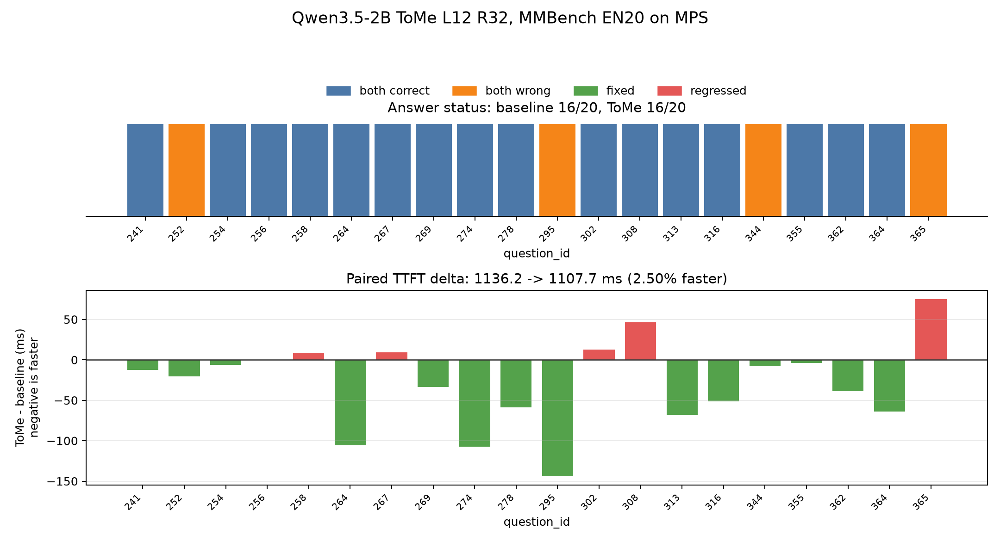
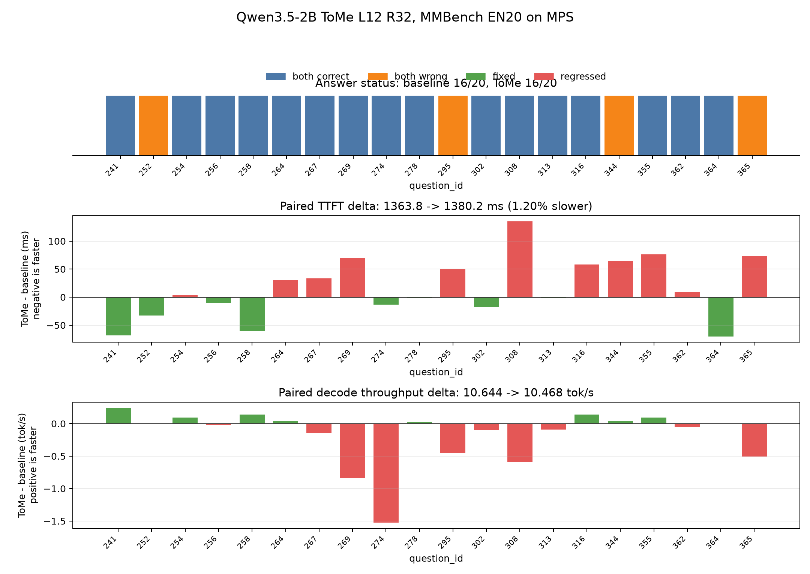
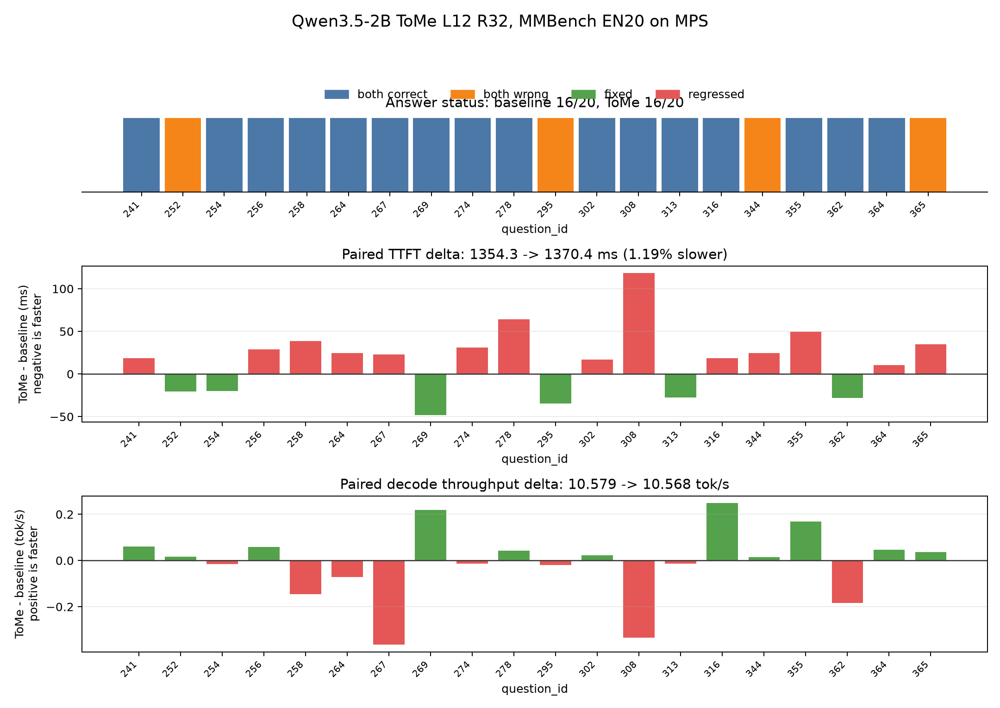
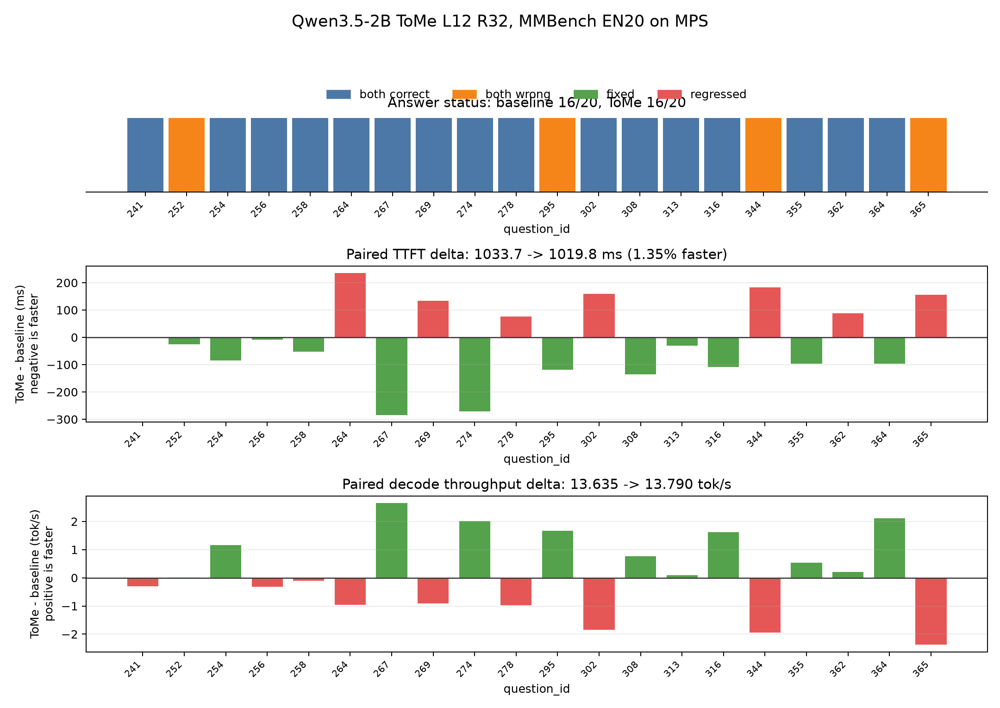
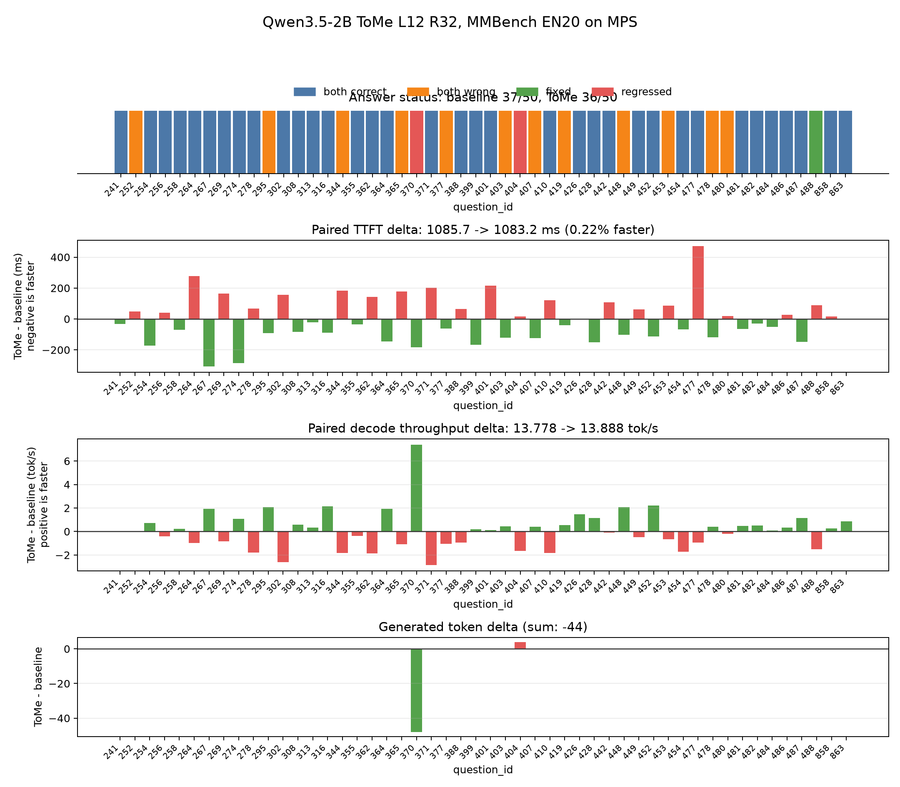
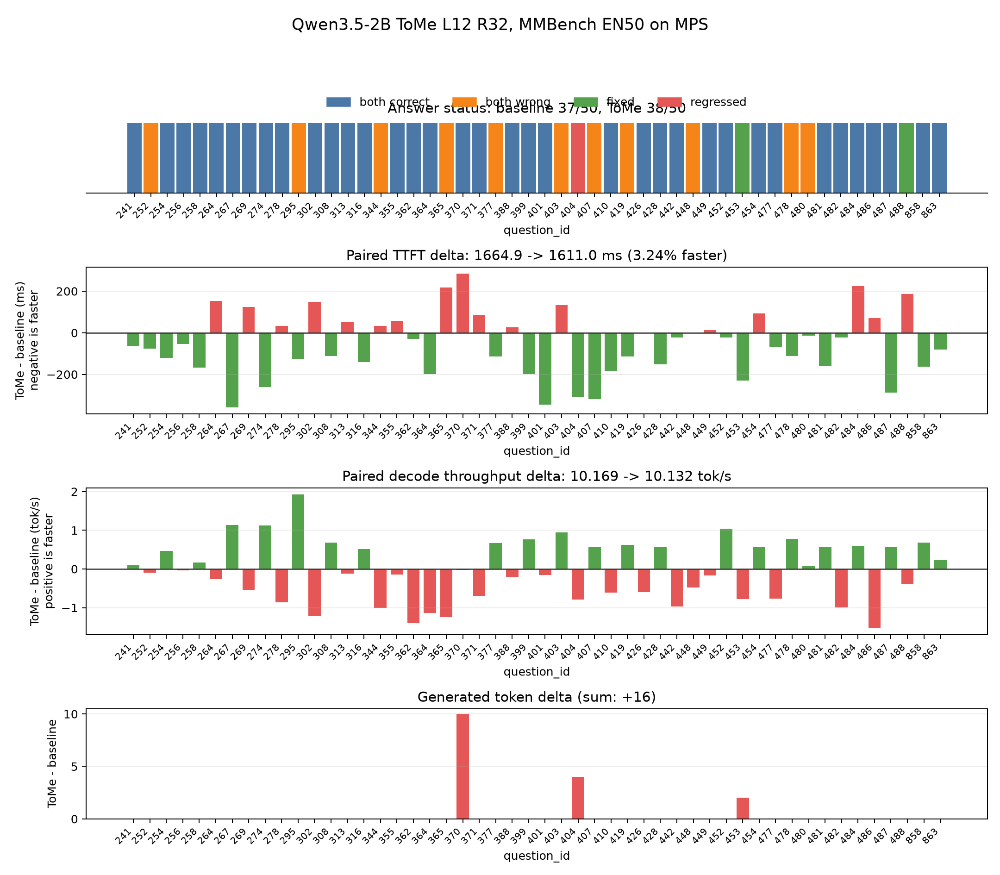
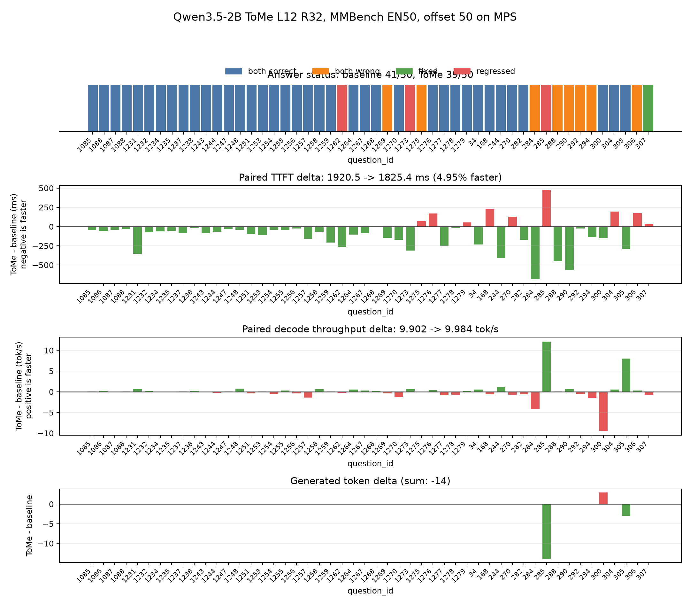

# Qwen3.5-2B 单层 ToMe 阶段实验

日期：2026-07-12

> [!NOTE]
> 本报告记录官方 DNDX v1.1 发布前的探索实验。涉及完整回答的实验使用
> `max_new_tokens=64` 和当时的本地答案解析协议，仅用于参数筛选与机制分析；
> 最终准确率、吞吐率和端到端耗时结论以 `tome_complete_evaluation.md`
> 中的官方 v1.1（256 Token）复测为准。

## 实验目的

验证 ToMe 是否能够在 Qwen3.5-2B 的视觉编码器内部形成真实 wall-clock 加速，同时保持语言模型输入契约和公开样本答案稳定。

本阶段实现与计划见：

- `tome_reproduction_plan.md`
- `src/optiz_qwen/compression/tome.py`
- `src/optiz_qwen/compression/qwen35_tome.py`

## 实现摘要

当前适配以 Qwen3.5 原生 2×2 `PatchMerger` unit 为最小单位：

1. 使用视觉 Attention 已计算的 Key 作为 ToMe 匹配 metric；
2. 在指定视觉层的 Attention 后、MLP 前执行 bipartite soft matching；
3. 对相似 unit 做 size-weighted merge；
4. 同步裁剪二维 RoPE 和 packed `cu_seqlens`；
5. 后续视觉层处理紧凑序列；
6. 在最后一个视觉层后按合并映射恢复原长度，再进入原生 `PatchMerger`。

最后一步是 Qwen3.5 适配所必需的。早期 smoke 曾直接输出紧凑序列，外层根据 `grid_thw` 仍要求原始图像特征数量，因而在 `torch.split` 处立即报错。恢复原长度后，语言模型看到的视觉 Token 数与 baseline 完全一致，节省只发生在视觉编码器内部。

## 测试条件

- 模型：Qwen3.5-2B，本地权重
- 设备：Apple Silicon MPS
- 数据：MMBench dev EN，顺序取样
- 生成：`max_new_tokens=1`
- 预热：2 条样本
- 正式对比：20 条样本
- Baseline：ToMe 关闭
- Candidate：视觉第 12 层执行 ToMe，`r=32`
- KV Chain、视觉输入缩放：关闭

本实验将生成长度设为 1，是为了突出视觉编码器和 prefill 的 TTFT 变化。因此报告不解释该配置下的 token/s；单 Token 运行的吞吐分母过小，不代表完整 decode 吞吐。

## EN5 参数筛选

先用 EN5 比较固定 `r=32` 的不同合并位置：

| 配置 | 平均 TTFT | 相对 baseline | 正确数 |
|---|---:|---:|---:|
| Baseline | 1135.85 ms | - | 4/5 |
| Layer 2, r=32 | 1081.54 ms | 快 4.78% | 3/5 |
| Layer 8, r=32 | 1101.72 ms | 快 3.00% | 3/5 |
| Layer 12, r=32 | 1122.10 ms | 快 1.21% | 4/5 |
| Layer 16, r=32 | 1138.44 ms | 慢 0.23% | 4/5 |

这组筛选呈现出合理边界：合并越早，可节省的后续视觉层越多，但准确率风险越高；合并过晚能够恢复答案，却没有足够剩余层数覆盖 merge 开销。第 12 层是 EN5 中唯一同时保持正确数并产生正向 TTFT 的配置，因此进入 EN20。

## EN20 结果

### 汇总指标

| 指标 | Baseline | ToMe L12 R32 | 变化 |
|---|---:|---:|---:|
| 样本数 | 20 | 20 | 0 |
| 正确率 | 0.80 | 0.80 | 0 |
| 正确题数 | 16/20 | 16/20 | 0 |
| Public Validation | 通过 | 通过 | 无回归 |
| 平均 TTFT | 1136.18 ms | 1107.72 ms | **-28.46 ms / -2.50%** |
| TTFT 中位配对差值 | - | - | **-16.48 ms** |

20 条答案逐题完全一致，没有出现“一道修复、另一本道回归后总正确数碰巧不变”的情况。

### 逐样本稳定性

| 统计 | 结果 |
|---|---:|
| ToMe 更快 | 14/20 |
| ToMe 更慢 | 6/20 |
| 最佳配对差值 | -143.78 ms |
| 最差配对差值 | +74.97 ms |
| 平均 merge host 时间 | 36.30 ms |
| merge host 时间中位数 | 49.77 ms |

平均值和中位数均为正向，且多数样本加速，因此当前信号不是单个极端样本造成。不过 MPS 热状态仍会产生明显逐题波动，最终结论需要更大样本和重复运行。

### Token 压缩范围

EN20 的视觉编码器输入覆盖 `256-768` 个 Patch Token。固定 `r=32` 每张图减少 32 个 2×2 unit，即固定减少 128 个 Patch Token：

- 紧凑视觉序列范围：`128-640`；
- 最小输入的内部压缩率：50%；
- 最大输入的内部压缩率：约 16.7%；
- 视觉编码器末层后恢复原长度，语言模型视觉 Token 数不变。

固定 `r` 因而对小图明显更激进。它适合验证 ToMe 能否加速，但未必是最终最稳健的 schedule。

## 正常生成长度复核

单 Token 实验只能反映 prefill。为检查完整 benchmark，本项目使用同一 EN20 样本重新运行 `max_new_tokens=64`，其余设置保持一致。模型实际每题生成 `6-36` Token，两组总生成量均为 247 Token。

| 指标 | Baseline | ToMe L12 R32 | 变化 |
|---|---:|---:|---:|
| 正确率 | 0.80 | 0.80 | 0 |
| 逐题答案变化 | - | 0/20 | 无变化 |
| 总生成 Token | 247 | 247 | 0 |
| 平均 TTFT | 1363.83 ms | 1380.24 ms | +16.41 ms / +1.20% |
| 平均 decode 吞吐 | 10.644 tok/s | 10.468 tok/s | -1.65% |
| Benchmark 总时间 | 68.00 s | 68.35 s | +0.51% |
| 每样本平均时间 | 3.400 s | 3.418 s | +0.51% |
| Public Validation | 通过 | 通过 | 无回归 |

逐题配对结果：

- TTFT：9/20 更快，中位差值 `+6.91 ms`，平均配对差值 `+16.41 ms`；
- decode 吞吐：8/20 更快，中位差值 `-0.014 tok/s`，平均配对差值 `-0.176 tok/s`；
- 平均 merge host 时间：`34.34 ms`；
- 答案和生成 Token 数逐题完全一致，因此差异不是由输出长度变化造成。

完整生成结果没有复现单 Token 实验的 `2.50%` TTFT 提升。ToMe 只改变视觉 prefill，视觉编码器末层又恢复原始长度，因此理论上不应改善 decode；实测 TTFT、decode 吞吐和端到端总时间均为负向。当前完整口径没有性能收益。

## 当前结论

### 已证明

1. Qwen3.5 的视觉编码器可以在不修改 Transformers 安装源码的情况下接入 ToMe。
2. 合并后的紧凑 hidden states、RoPE 和 `cu_seqlens` 能够贯穿后续视觉层。
3. 末层恢复映射能够保持原生 `PatchMerger` 和语言模型接口。
4. `layer=12, r=32` 在 EN20 单 Token实验中保持逐题答案完全一致，并将平均 TTFT 降低约 2.50%。
5. 在正常生成长度下，答案和生成长度仍保持一致，但 TTFT 慢约 1.20%，总 benchmark 慢约 0.51%。

### 尚未证明

1. 20 条样本不足以证明完整公开集准确率无损。
2. 当前只支持单次合并层，还没有实现论文中的多层 schedule。
3. 固定 `r=32` 对不同分辨率的压缩比例不一致。
4. 尚未比较 proportional attention 和按比例确定 `r`。

## 下一步

1. 将单层 `r` 扩展为按初始 unit 数比例计算，同时设置明确最小保留量。
2. 实现多层 schedule，并正确组合多次 merge 的恢复映射。
3. 先用正常生成长度筛选配置，只有端到端总时间改善的方案才进入 EN50。
4. 对通过筛选的单层和多层配置运行 EN50。
5. 若 EN50 仍保持答案且稳定提速，再补 CN50 和重复运行统计。

当前结果证明 ToMe 适配链路可行，但尚未形成完整 benchmark 的端到端性能提升。单 Token prefill 的正向结果不能作为最终竞赛收益。

## 去除 MPS 设备回读

进一步检查发现，初版 merge 入口会对 MPS 张量执行 `torch.any()`、`.item()` 和 `.cpu().tolist()`。这些操作会等待此前异步提交的视觉 Attention，既打断 MPS 流水，也使 `merge_host_ms` 混入前序算子的等待时间。

实现随后拆成两个明确入口：

- packed 多图路径保留完整 `cu_seqlens` 边界校验；
- Qwen 单图路径直接从 hidden-state shape 构造 `[0, token_count]`，不读取设备上的序列元数据。

EN5 单 Token smoke 中，平均 `merge_host_ms` 从此前完整实验约 `34.34 ms` 降到 `6.51 ms`，下降约 81%。随后重新顺序运行一组 EN20、正常生成长度 benchmark：

| 指标 | Baseline | ToMe L12 R32 | 变化 |
|---|---:|---:|---:|
| 正确率 | 0.80 | 0.80 | 0 |
| 逐题答案变化 | - | 0/20 | 无变化 |
| 总生成 Token | 247 | 247 | 0 |
| 平均 TTFT | 1354.25 ms | 1370.42 ms | +16.16 ms / +1.19% |
| 平均 decode 吞吐 | 10.579 tok/s | 10.568 tok/s | -0.10% |
| Benchmark 总时间 | 67.00 s | 66.92 s | -0.13% |

逐题 TTFT 仅 6/20 更快，中位差值为 `+20.82 ms`。吞吐有 11/20 更快，中位差值为 `+0.016 tok/s`，整体基本持平。

该结果说明显式设备回读确实是不必要开销，但并不是当前端到端无收益的唯一原因。完整运行中的 `merge_host_ms` 仍会受 MPS 命令队列阻塞影响，不能视为纯 merge kernel 时间；同时，Qwen 视觉层在 `256-768` Patch Token 范围内缩短序列后，MPS kernel 未必能获得与理论 FLOPs 相称的 wall-clock 收益。

因此，下一步不应继续凭 `merge_host_ms` 猜测，而应分别同步测量匹配、聚合、后续 Attention 和 MLP 的真实设备时间，确认究竟是 merge 算子过慢，还是 MPS 对缩短后的视觉层没有有效加速。

## ToMe 核心算子同步剖析

为排除异步 host 计时的归因错误，新增 `scripts/profile_tome_operator.py`。该脚本在每个阶段前后同步 MPS，使用 Qwen3.5 视觉 hidden size `1024`、BF16、`r=32`，对四档实际 Token 规模分别预热 5 次并重复 20 次。

| 输入 Token | 紧凑 Token | Metric preparation | Matching | Aggregation | Output compaction | 总计 |
|---:|---:|---:|---:|---:|---:|---:|
| 256 | 128 | 0.294 ms | 0.451 ms | 0.395 ms | 0.946 ms | 2.478 ms |
| 320 | 192 | 0.362 ms | 0.619 ms | 0.645 ms | 1.085 ms | 3.221 ms |
| 480 | 352 | 0.379 ms | 0.609 ms | 0.650 ms | 1.148 ms | 3.345 ms |
| 768 | 640 | 0.374 ms | 0.494 ms | 0.727 ms | 1.159 ms | 3.184 ms |

结果明确排除了“ToMe 核心算子需要数十毫秒”这一猜测。Matching 和 aggregation 合计通常只有约 `0.85-1.38 ms`，完整核心约 `2.5-3.4 ms`。最大单项是输出 compaction，但也只有约 `1 ms`。

因此，当前 TTFT 无收益不能主要归因于 ToMe matching/aggregation。下一项必须验证：序列缩短后，Qwen3.5 后续视觉 Attention 和 MLP 在 MPS 上是否真的减少 wall-clock 时间。

## 视觉 Block 同步剖析

新增 `scripts/profile_tome_visual_blocks.py`，在同一个模型实例上依次测量 baseline 和 ToMe。使用 EN5、两条预热样本，并在每个视觉 Block 前后同步 MPS。该诊断会破坏正常异步流水，只用于回答各层真实设备计算是否下降。

输入均为 320 个 Patch Token；第 12 层执行 ToMe 后，第 13-23 层输入变为 192 个。

| 区域 | Baseline | ToMe | 变化 |
|---|---:|---:|---:|
| 第 0-11 层 | 92.52 ms | 90.70 ms | -1.82 ms |
| 第 12 层（含 merge） | 7.94 ms | 10.86 ms | +2.92 ms |
| 第 13-23 层 | 83.27 ms | 59.31 ms | **-23.96 ms** |
| 24 个视觉 Block 合计 | 183.73 ms | 160.86 ms | **-22.86 ms / -12.44%** |

第 13-23 层中，除第 13 层只快约 `0.26 ms` 外，其余各层通常节省 `1.4-3.1 ms`。这明确回答了第二个问题：**MPS 上缩短视觉序列确实能加速后续视觉 Block，而且节省明显高于 ToMe 核心约 3 ms 的成本。**

因此，当前矛盾不再是“merge 太慢”或“短序列在 MPS 上不加速”。新的待解决问题是：视觉 Block 已净省约 `22.9 ms`，为什么完整 benchmark 的 TTFT 没有稳定下降？下一步需要同时记录完整视觉模型、语言模型 prefill 和外层调度时间，检查收益是否被视觉 Block 之外的同步、恢复、PatchMerger 或 benchmark 波动抵消。

### 完整视觉模型时间

在同一 profiler 中增加完整 `model.visual` 计时后，得到一组更稳定的 EN5 同步结果：

| 区域 | Baseline | ToMe | 变化 |
|---|---:|---:|---:|
| 24 个视觉 Block | 148.91 ms | 133.46 ms | -15.45 ms |
| 非 Block 视觉部分 | 89.88 ms | 90.90 ms | +1.03 ms |
| **完整视觉模型** | **238.79 ms** | **224.36 ms** | **-14.42 ms / -6.04%** |

非 Block 部分包含 PatchEmbed、位置编码准备、末层恢复和 `PatchMerger`。它只增加约 `1 ms`，没有抵消后续视觉层的收益。由此可以确认：ToMe 在完整视觉模块内部已经产生真实 wall-clock 加速。

分进程 benchmark 未稳定体现这约 `14 ms`，更可能来自 MPS 热状态与两次独立运行之间的波动。下一步应在同一个模型实例中交替运行 baseline/ToMe，并对每道题做配对比较。

## 同模型交替配对 Benchmark

为消除两个独立进程之间的 MPS 热状态差异，新增：

- `set_qwen35_tome_enabled()`：在已经安装适配器的模型上显式切换 baseline/ToMe；
- `scripts/benchmark_tome_paired.py`：同一模型、同一道题分别运行两种模式，奇偶题交替执行顺序。

两种模式都经过相同的 Python wrapper，因此结果用于估计 ToMe 的净增量，不用于替代官方 baseline 的绝对时间。

| 指标 | Paired baseline | ToMe L12 R32 | 变化 |
|---|---:|---:|---:|
| 正确率 | 0.80 | 0.80 | 0 |
| 逐题答案变化 | - | 0/20 | 无变化 |
| 总生成 Token | 247 | 247 | 0 |
| 平均 TTFT | 1033.75 ms | 1019.80 ms | **-13.95 ms / -1.35%** |
| 平均 decode 吞吐 | 13.635 tok/s | 13.790 tok/s | **+1.14%** |
| 推理 elapsed 合计 | 39.483 s | 39.265 s | **-0.218 s / -0.55%** |

逐题配对统计：

- TTFT：12/20 更快，中位差值 `-27.26 ms`；
- decode 吞吐：11/20 更快，中位差值 `+0.052 tok/s`；
- 单题 elapsed：11/20 更快，中位差值 `-29.89 ms`；
- 答案和 Token 数逐题完全一致。

这组结果与视觉模块同步剖析一致：视觉模型内部净省约 `14.42 ms`，paired TTFT 平均净省约 `13.95 ms`。因此，先前独立进程 benchmark 中的负向结果主要来自跨进程 MPS 状态漂移，而不是 ToMe 没有加速。

当前可以作出的严谨结论是：**Qwen3.5 ToMe L12 R32 在 EN20 上保持输出不变，并在同模型交替测量中带来约 1.35% TTFT 和 0.55% 单次推理总时间收益。** 下一步仍需扩大到 EN50，并通过重复 paired 运行估计方差。

## EN50 Paired 验证

将相同 `L12 R32` 配置扩展到 EN50 后，EN20 的理想结果没有完整复现：

| 指标 | Paired baseline | ToMe L12 R32 | 变化 |
|---|---:|---:|---:|
| 正确率 | 37/50（0.74） | 36/50（0.72） | **-1 题 / -2 个百分点** |
| 平均 TTFT | 1085.65 ms | 1083.22 ms | -2.43 ms / -0.22% |
| TTFT 中位配对差值 | - | -25.05 ms | ToMe 更快 |
| TTFT 更快样本 | - | 26/50 | 略过半 |
| 平均 decode 吞吐 | 13.778 tok/s | 13.888 tok/s | +0.79% |
| 推理 elapsed 合计 | 94.76 s | 90.17 s | -4.60 s |
| 总生成 Token 变化 | - | -44 | 输出长度不一致 |

答案发生变化的 3 题：

| Question ID | Baseline | ToMe | 结果变化 |
|---|---|---|---|
| 370 | B | A | 正确 → 错误 |
| 404 | B | A | 正确 → 错误 |
| 488 | A | B | 错误 → 正确 |

因此，准确率净下降 1 题。生成 Token 总数减少 44，意味着 elapsed 和吞吐变化受到回答长度影响，不能全部归因于算子加速。TTFT 不依赖完整生成长度，仍可用于观察 prefill，但其均值仅改善约 `0.22%`，没有达到 EN20 的 `1.35%`。

EN50 明确否定了“L12 R32 已经是准确率无损的稳定候选”。下一步应降低压缩强度，优先验证 `r=16` 或按输入 unit 比例限制压缩；只有准确率和逐题答案稳定后，才继续讨论性能收益。

## 降低压缩强度筛选

使用相同 EN20 paired 方法筛选 `L12 R16` 和 `L12 R8`：

| 配置 | 准确率 | 答案变化 | 平均 TTFT 变化 | TTFT 中位差值 | 更快样本 |
|---|---:|---:|---:|---:|---:|
| L12 R16 | 16/20 → 16/20 | 2 题 | -11.86 ms / -1.07% | -44.66 ms | 13/20 |
| L12 R8 | 16/20 → 17/20 | 1 题 | +5.48 ms / +0.52% | -29.10 ms | 12/20 |

R16 中，一道错题被修复、一道正确题回归，总分碰巧不变；R8 中一道错题被修复，因此总分上升 1 题。两者都说明输出仍对合并敏感，不能称为逐题无损。

性能上，R16 有约 1.07% 平均 TTFT 收益，但输出不稳定；R8 压缩较弱，TTFT 均值反而变慢。继续机械枚举更小 `r` 的预期收益已经很低。

下一步应回到 ToMe 论文的信息保持机制，评估 proportional attention 或更晚层合并，而不是只调整删除数量。若实现 proportional attention 的侵入性过高，则应把当前方案归类为“视觉模块真实加速、但准确率与端到端收益尚未形成稳定 Pareto 优势”。

## Proportional Attention

按照 ToMe 论文，为每个合并 Token 维护 size，并在后续视觉 Attention 的 key logits 中加入 `log(size)`。本项目为 Qwen3.5 增加显式 SDPA 路径，复用原始 QKV、二维 RoPE 和输出投影；默认关闭，只在合并层之后启用。

数学单元测试验证：两个 value 的 size 分别为 1 和 3、原始 attention logits 相同时，输出按 1:3 的总质量加权。

### EN20

`L12 R32 + proportional attention`：

| 指标 | Baseline | Candidate | 变化 |
|---|---:|---:|---:|
| 正确率 | 16/20 | 16/20 | 0 |
| 答案变化 | - | 0/20 | 无变化 |
| 平均 TTFT | 1328.61 ms | 1302.29 ms | -26.32 ms / -1.98% |
| TTFT 中位差值 | - | -56.54 ms | Candidate 更快 |
| 推理 elapsed 合计 | 50.42 s | 49.77 s | -0.65 s / -1.28% |

EN20 同时保持逐题输出并改善 TTFT，因此继续扩大到 EN50。

### EN50

| 指标 | Baseline | Candidate | 变化 |
|---|---:|---:|---:|
| 正确率 | 37/50（0.74） | 38/50（0.76） | **+1 题 / +2 个百分点** |
| 平均 TTFT | 1664.90 ms | 1611.00 ms | **-53.90 ms / -3.24%** |
| TTFT 中位差值 | - | -58.26 ms | Candidate 更快 |
| TTFT 更快样本 | - | 33/50 | 66% |
| 平均 decode 吞吐 | 10.169 tok/s | 10.132 tok/s | -0.37% |
| 推理 elapsed 合计 | 137.77 s | 137.26 s | -0.51 s / -0.37% |
| 总生成 Token 变化 | - | +16 | Candidate 输出更长 |

答案变化：

| Question ID | Baseline | Candidate | 结果变化 |
|---|---|---|---|
| 404 | B | A | 正确 → 错误 |
| 453 | A | B | 错误 → 正确 |
| 488 | A | B | 错误 → 正确 |

Proportional attention 没有减少答案变化数量：普通 R32 和 proportional attention 都有 3 题变化。但变化方向从普通 R32 的“两道回归、一道修复”改善为“一道回归、两道修复”，净准确率由下降 1 题变为上升 1 题。

因此它没有解决“逐题无损”问题，却形成了目前第一组正向 Pareto 候选：EN50 平均准确率上升 2 个百分点，同时 TTFT 下降约 3.24%。由于只完成一次 EN50 paired 运行，仍需重复实验确认答案变化和 TTFT 收益是否稳定；decode 吞吐轻微下降，不能声明吞吐优化。

### 同批 EN50 重复运行

对相同前 50 题独立重复一次 paired 实验：

| 指标 | 第一次 | 第二次 |
|---|---:|---:|
| Baseline → Candidate 正确数 | 37 → 38 | 37 → 38 |
| 答案变化题 | 404、453、488 | 404、453、488 |
| 答案变化方向 | 1 回归、2 修复 | 1 回归、2 修复 |
| 总生成 Token 变化 | +16 | +16 |
| 平均 TTFT 差值 | -53.90 ms | -86.64 ms |
| TTFT 中位差值 | -58.26 ms | -83.66 ms |
| TTFT 更快样本 | 33/50 | 36/50 |
| TTFT 提升比例 | 3.24% | 4.91% |

答案、准确率和 Token 数结果完全复现，说明 `37→38` 不是单次随机计分波动。TTFT 幅度随 MPS 状态变化，但两次均为明确正向。

### 第二组不重叠 EN50

随后使用 `sample_offset=50` 运行第 51-100 条样本：

| 指标 | Baseline | Candidate | 变化 |
|---|---:|---:|---:|
| 正确率 | 41/50（0.82） | 39/50（0.78） | **-2 题 / -4 个百分点** |
| 平均 TTFT | 1920.52 ms | 1825.42 ms | **-95.11 ms / -4.95%** |
| TTFT 中位差值 | - | -66.56 ms | Candidate 更快 |
| TTFT 更快样本 | - | 41/50 | 82% |
| 平均 decode 吞吐 | 9.902 tok/s | 9.984 tok/s | +0.83% |
| 推理 elapsed 合计 | 143.54 s | 136.52 s | -7.02 s / -4.89% |
| 总生成 Token 变化 | - | -14 | Candidate 输出更短 |

第二组有 4 题答案变化：3 道回归、1 道修复，净下降 2 题。因此，“proportional attention 同时提高准确率”的结论不能泛化。

合并两组不重叠的 100 题：

- Baseline：78/100；
- Candidate：77/100；
- 净准确率：下降 1 题；
- 答案变化：7/100，其中 4 回归、3 修复；
- 两组加权平均 TTFT：约 `1792.71 → 1718.21 ms`，提升约 `4.16%`；
- 推理 elapsed 合计：`281.30 → 273.77 s`，下降约 `2.68%`。

### 回归归因

7 道变化题的原始视觉 Token 与压缩比例没有形成简单规律：

- 回归题输入 Token：768、384、384、280；
- 修复题输入 Token：全部为 384；
- 回归题平均压缩率约 32.3%；
- 稳定题平均压缩率约 34.6%。

回归类型包括表格逻辑、磁力属性推理和图像色彩质量；修复类型包括粒子浓度、属性识别和空间关系。由此不能把回归简单归因于“小图被固定 R32 过度压缩”，也没有证据表明 proportional attention 只帮助某一类题。

更完整的结论是：**proportional attention 的 TTFT 收益在两组共 100 个不重叠样本上表现稳定，约为 4%；但它会以内容相关的方式改变约 7% 的答案，合计准确率净下降 1 个百分点。** 当前方案构成有损速度优化候选，而不是准确率无损 Pareto 解。
