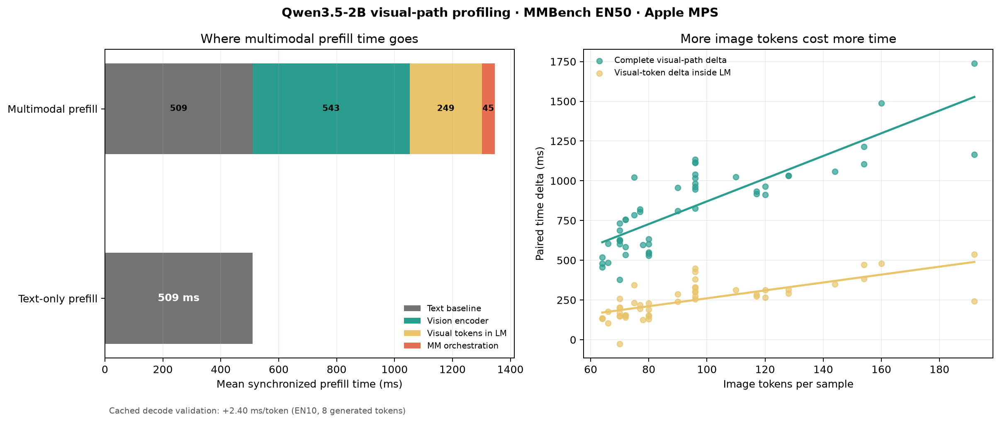

# Qwen3.5-2B 视觉路径耗时剖析

日期：2026-07-12

## 研究问题

此前实验已经证明，当前 FastV 风格中间层剪枝没有形成有利的准确率-性能权衡。但这还不能证明视觉路径本身不是瓶颈，因为失败可能来自剪枝实现的额外开销。

本实验进一步回答三个问题：

1. 完整视觉路径为一次 prefill 增加多少时间？
2. 这些时间分别消耗在视觉编码器、语言模型中的视觉 Token、还是其他多模态处理上？
3. 视觉 Token 留在 cache 中后，对逐 Token decode 有多大影响？

## 方法

### Prefill：EN50 成对测量

- 模型：本地 Qwen3.5-2B，BF16
- 设备：Apple Silicon MPS
- 数据：MMBench dev EN 前 50 条
- 每条题目使用完全相同的文本 Prompt，分别执行：
  - 正常图文 prefill；
  - 移除图片后的 text-only prefill。
- 两种模式交替运行，减少固定顺序偏差。
- 每个计时边界调用 `torch.mps.synchronize()`，避免 MPS 异步执行造成错误归因。
- forward 使用 `use_cache=True` 和 `logits_to_keep=1`，与正式 `generate()` 的首 Token 路径保持一致。
- 关闭视觉 Token 剪枝与 KV Chain。

图文与 text-only 的差值代表在相同问题文本下，引入图片产生的视觉路径增量。模型内部另行记录视觉编码器和语言模型 forward，从而进一步拆分视觉成本。

### Decode：EN10 短批次验证

长时间、逐步同步的 MPS decode profiling 会导致明显热状态漂移。因此 decode 使用独立短批次：

- MMBench dev EN 前 10 条；
- 每种输入强制生成 8 个 Token；
- 其中第一个 Token 由 prefill 产生，统计后续 7 个 cached decode step；
- 比较图文 cache 与同题 text-only cache 的逐步耗时。

## 结果图

原始逐样本数据：

- `visual_token_cost_profile_en50_mps.csv`
- `visual_token_cost_decode_en10_mps.csv`

## Prefill 结果

### 平均耗时分解

| 部分 | 平均耗时 | 占图文 forward |
|---|---:|---:|
| 同题 text-only forward | 509.21 ms | 37.84% |
| 视觉编码器 | 543.29 ms | 40.37% |
| 视觉 Token 导致的语言模型增量 | 248.79 ms | 18.49% |
| 多模态特征注入、位置与顶层调度增量 | 44.60 ms | 3.31% |
| **完整图文 forward** | **1345.90 ms** | **100.00%** |

若把 processor 和设备传输也纳入：

| 路径 | 平均耗时 |
|---|---:|
| 图文 processor + transfer + forward | 1358.34 ms |
| 同题 text-only processor + transfer + forward | 515.24 ms |
| **完整视觉路径增量** | **843.10 ms** |

完整视觉路径约占图文 prefill 路径的 `62.07%`。因此，视觉模态整体确实是当前 TTFT 的重要组成部分。

但这 `843.10 ms` 不能全部通过语言模型中的视觉 Token 剪枝消除。视觉增量内部约为：

| 视觉增量来源 | 平均耗时 | 占视觉增量 |
|---|---:|---:|
| 视觉编码器 | 543.29 ms | 64.44% |
| 视觉 Token 在语言模型中的额外计算 | 248.79 ms | 29.51% |
| 多模态组织、processor 与 transfer 等 | 51.01 ms | 6.05% |

**中间层视觉 Token 剪枝能够直接触及的，主要是其中约 `248.79 ms` 的语言模型增量，而不是完整的 `843.10 ms`。**

### Token 数与耗时的关系

50 条样本包含 `64-192` 个视觉 Token，平均 `95.28`，中位数 `80`。

| 指标 | 与视觉 Token 数的 Pearson r |
|---|---:|
| 完整图文 forward | 0.644 |
| 视觉编码器耗时 | 0.860 |
| 完整视觉路径增量 | 0.833 |
| 语言模型视觉 Token 增量 | 0.715 |

相关性表明：视觉 Token 越多，视觉编码和语言模型 prefill 通常越慢。线性拟合在本次 `64-192` Token 区间内得到：

| 指标 | 每增加 1 个视觉 Token 的拟合增量 |
|---|---:|
| 完整图文 forward | 约 6.36 ms |
| 视觉编码器 | 约 4.62 ms |
| 完整视觉路径 | 约 7.14 ms |
| 语言模型视觉 Token 部分 | 约 2.49 ms |

这些斜率只用于描述当前样本区间，不能外推到 0 Token，因为各路径还包含固定启动成本。

## Decode 结果

独立 EN10、8 Token 短批次中，统计后续 7 个 cached decode step：

| 路径 | 平均每步 decode |
|---|---:|
| 同题 text-only cache | 63.89 ms/Token |
| 图文 cache | 66.29 ms/Token |
| **视觉 cache 增量** | **2.40 ms/Token** |

视觉 Token 留在 cache 中使逐 Token decode 平均增加约 `3.76%`。换算为吞吐率：

- text-only：约 `15.65 Token/s`；
- 图文：约 `15.09 Token/s`。

这一差异明显小于 prefill 视觉成本，并且视觉 Token 数与该差值的相关性在 10 条样本中不稳定。因此报告将 `2.40 ms/Token` 视为本机短批次估计，而不是高精度常数。

## 中间层剪枝的理想收益上限

当前语言模型中的视觉 Token 增量平均为 `248.79 ms`。在做一个对剪枝非常有利、但不现实的假设时：

- Token 计算成本与数量完全线性；
- 剪枝本身没有任何开销；
- 每层成本相同；
- 删除 50% Token；
- 不考虑 Qwen3.5 混合注意力结构造成的收益折损。

可以估算：

| 50% 剪枝位置 | 理想最多节省 | 占完整图文 forward |
|---|---:|---:|
| 第 4 / 24 层后 | 103.66 ms | 7.70% |
| 第 8 / 24 层后 | 82.93 ms | 6.16% |
| 第 12 / 24 层后 | 62.20 ms | 4.62% |

这是理论上界，不是预期实测值。Qwen3.5-2B 的 24 层中只有 6 层是 Gated Attention，其余 18 层是 Gated DeltaNet；同时动态排序、`topk`、张量重排、mask 和 cache 修改都需要时间，实际收益只会更低。

此前 FastV 风格实验中，剪枝操作带来的 TTFT 增量经常达到数百到数千毫秒，已经远大于这里估算的 `62-104 ms` 理想节省空间。这解释了为什么视觉 Token 数确实影响耗时，但当前中间层剪枝仍然变慢。

## 结论

### 1. 视觉路径是不是瓶颈？

**是。** 完整视觉路径平均增加约 `843 ms`，约占图文 prefill 路径的 `62%`。视觉 Token 数与视觉路径耗时有强相关性。

### 2. 中间层视觉 Token 剪枝能解决整个视觉瓶颈吗？

**不能。** 约 `64%` 的视觉增量发生在视觉编码器中，进入语言模型后才剪 Token 已经无法回收这部分时间。中间层剪枝直接面对的语言模型视觉增量只有约 `249 ms`，占完整图文 forward 的 `18.5%`。

### 3. 为什么当前剪枝没有加速？

因为可节省空间小于剪枝固定成本。平均只有约 `95` 个视觉 Token，删除一半后只少约 `48` 个；即使假设零开销，第 4 层后剪一半的理想上界也只有约 `104 ms`。当前动态剪枝实现的额外开销远高于这个上界。

### 4. 下一步应该优化哪里？

如果继续负责视觉方向，优先级应调整为：

1. **视觉编码器执行优化**：它单独占图文 forward 的约 `40%`，是最大的视觉成本。
2. **进入语言模型前的低开销压缩**：只有在不显著增加视觉编码器开销、且能保精度时才值得尝试。
3. **多模态位置与特征注入路径**：平均约 `45 ms`，收益较小但可能比复杂动态剪枝稳定。
4. **中间层动态视觉 Token 剪枝**：降为研究性支线，不再作为主性能突破口。

## 最终判断

此前“视觉 Token 已经足够少，所以剪枝可能不起效”的判断只说对了一半。

更准确的表述是：

> 视觉模态整体非常耗时，但主要成本在视觉编码器；Qwen3.5-2B 进入语言模型时平均只剩约 95 个视觉 Token，所以中间层剪枝能够触及的时间比例有限。当前剪枝算法的运行时成本超过了这部分有限收益，因此没有形成有效加速。
