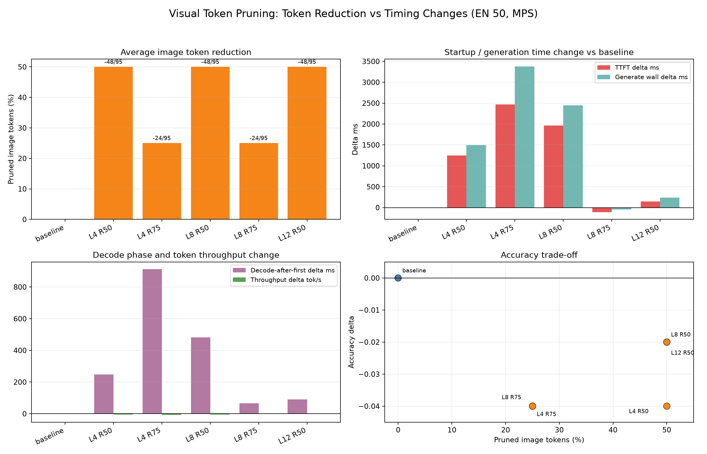

# Visual Token Pruning Timing Trade-off

Date: 2026-07-10

This note evaluates whether FastV-style image token pruning produces enough
runtime gain to justify its accuracy loss.

## Setup

- Dataset: MMBench dev EN, first 50 samples
- Device: Apple Silicon MPS
- Model: local Qwen3.5-2B
- Strategy: `attention_received`
- Baseline: no visual token pruning

## Result Figure

Raw summary table:

- `visual_token_pruning_timing_tradeoff_en50_mps.csv`

## Summary

| Config | Avg pruned image tokens | Accuracy | TTFT delta ms | Generate wall delta ms | Decode delta ms | Throughput delta tok/s |
| --- | ---: | ---: | ---: | ---: | ---: | ---: |
| baseline | 0 / 0 | 0.76 | 0.0 | 0.0 | 0.0 | 0.000 |
| L4 R50 | 48 / 95 | 0.72 | +1248.1 | +1495.2 | +247.1 | -4.513 |
| L4 R75 | 24 / 95 | 0.72 | +2465.3 | +3377.2 | +911.9 | -7.423 |
| L8 R50 | 48 / 95 | 0.74 | +1963.8 | +2446.0 | +482.2 | -5.330 |
| L8 R75 | 24 / 95 | 0.72 | -108.0 | -42.6 | +65.4 | -0.863 |
| L12 R50 | 48 / 95 | 0.74 | +148.3 | +239.5 | +91.2 | -1.836 |

## Interpretation

Reducing image tokens does not consistently reduce runtime in the current
implementation. Most configurations increase both TTFT and total generation
time. The only configuration that reduces TTFT and generate-wall time is
`L8 R75`, but it still reduces throughput and loses accuracy.

The timing split suggests the main cost is not preprocessing or device transfer.
The loss comes from the model generation path itself: eager attention for
ranking, dynamic token selection, mask rebuilding, and KV-cache pruning add
runtime overhead that is not offset by the reduced visual-token count.

## Current Decision

This evidence does not support adopting FastV-style visual token pruning as a
default optimization route. It remains useful as an experimental probe, but the
current implementation does not provide a favorable accuracy-speed trade-off.
