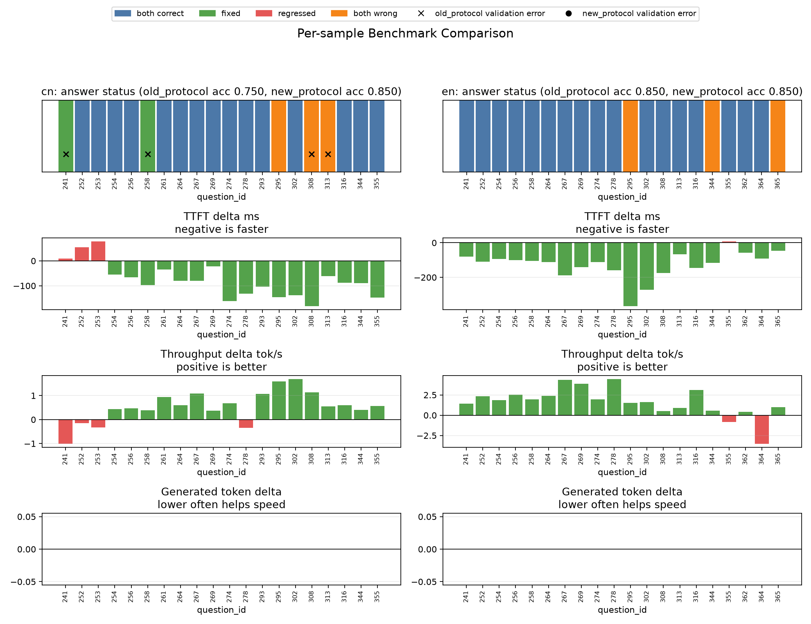

# Benchmark Protocol Migration Report

Date: 2026-07-09

This report records the benchmark protocol migration after merging `origin/main`.
The result should be treated as a new local benchmark baseline, not as a pure
model optimization gain.

## Scope

- Device: Apple Silicon MPS
- Model: local `Qwen3.5-2B`
- Dataset: public MMBench dev TSV
- Sample count: 20 CN + 20 EN
- Seed: `20260625`
- KIVI KV cache: disabled

## Protocol Changes

The merged version changes the benchmark behavior in several ways:

- Adds `accelerate` to the public benchmark dependency list.
- Adds KIVI KV-cache scaffolding behind explicit switches. It is off by default.
- Adds a stronger answer parser through `answer_parsing.py`.
- Adds `--max-new-tokens`, with the merged default set to `64`.
- Adds an optional logits-based choice fallback controlled by
  `OPTIZ_QWEN_CHOICE_FALLBACK`. In this run, fallback was not actually used by
  any sample.
- Keeps image-token metadata in benchmark outputs:
  `input_image_size`, `image_grid_thw`, and `image_token_count`.

## Summary

| Dataset | Metric | Old Protocol | New Protocol | Delta |
| --- | ---: | ---: | ---: | ---: |
| CN | Accuracy | 0.750 | 0.850 | +0.100 |
| CN | Correct / Total | 15 / 20 | 17 / 20 | +2 |
| CN | Avg TTFT ms | 1021.725 | 944.784 | -76.941 |
| CN | Avg throughput tok/s | 14.700 | 15.237 | +0.537 |
| CN | Validation failed samples | 4 | 0 | -4 |
| EN | Accuracy | 0.850 | 0.850 | 0.000 |
| EN | Correct / Total | 17 / 20 | 17 / 20 | 0 |
| EN | Avg TTFT ms | 1231.049 | 1104.527 | -126.522 |
| EN | Avg throughput tok/s | 19.439 | 21.066 | +1.627 |
| EN | Validation failed samples | 0 | 0 | 0 |

## Per-Sample Changes

CN:

- Fixed wrong answers: `241`, `258`
- New wrong answers: none
- Fixed validation errors: `241`, `258`, `308`, `313`
- New validation errors: none

EN:

- Fixed wrong answers: none
- New wrong answers: none
- Fixed validation errors: none
- New validation errors: none

## Visualization

## Interpretation

The CN score improves from `0.750` to `0.850`, and public validation changes
from failing four samples to passing all samples. The most important practical
change is therefore benchmark stability: the new parser avoids treating valid
model answers as invalid just because their format is less rigid.

The EN score stays at `0.850`, but latency metrics improve in this 20-sample
run. Because the protocol changed at the same time as the code changed, this
should not be reported as an optimization speedup. It is better to describe it
as the new local benchmark baseline after merging upstream work.

The optional logits fallback did not affect this run:

- CN fallback-used samples: `0 / 20`
- EN fallback-used samples: `0 / 20`

The merged KIVI KV-cache path was also disabled:

- `kivi_kv_cache_requested_by_cli`: `false`
- `kivi_kv_cache_enabled_by_env`: `false`

## Recommendation

Use this merged benchmark protocol as the team's new baseline from this point
forward. Future optimization reports should compare against:

- `benchmarks/output/result_dev_cn_20_new_protocol_mps.json`
- `benchmarks/output/result_dev_en_20_new_protocol_mps.json`

Old-protocol results can remain as historical context, but they should not be
mixed with new-protocol optimization claims.
